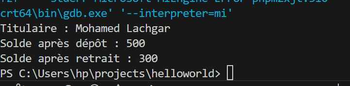
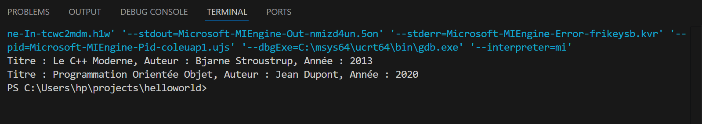

#  TP1 : Définition des Classes  


---

##  Objectif pédagogique
Ce TP a pour but de **consolider la compréhension des bases de la POO en C++**, notamment :
- la **déclaration de classes**,
- la **définition des méthodes**,
- les **modificateurs d’accès** (`private`, `public`),
- la **création et manipulation d’objets**.

---

## Exercice 1 : Gestion de Compte Bancaire Simple

###  Énoncé
Créer une classe `CompteBancaire` qui modélise un compte bancaire basique.

###  Spécifications
- **Attributs privés :**
  - `titulaire` : nom du titulaire (`std::string`)
  - `solde` : montant disponible (`double`)
- **Méthodes publiques :**
  - `void definirTitulaire(std::string nom)`
  - `void depot(double montant)`
  - `void retrait(double montant)`
  - `void afficher()`

Le retrait doit vérifier que le solde est suffisant avant d’effectuer l’opération.

---

## Exemple d’exécution (texte)

```bash
Titulaire : Mohamed Lachgar
Solde après dépôt : 500.0
Solde après retrait : 300.0
```

## Exemple d’exécution (image)

Voici un exemple de l'exécution du programme (screenshot) :




##  Exercice 2 – Gestion d’un Catalogue de Livres  

###  Objectif pédagogique  
Renforcer la maîtrise de la **déclaration de classes**, de **l'encapsulation**, des **méthodes d'accès**, et de la **création d’objets** en **C++** à travers un exemple concret du monde réel.  

---

### Énoncé  
Créer une classe `Livre` pour représenter un ouvrage dans un **catalogue de bibliothèque**.  

#### La classe doit contenir :
- un attribut privé `titre` (de type `std::string`)  
- un attribut privé `auteur` (de type `std::string`)  
- un attribut privé `anneePublication` (de type `int`)  

#### Les méthodes publiques suivantes sont requises :
- `void definirLivre(std::string t, std::string a, int annee)` : permet d’initialiser les informations d’un livre  
- `void afficher()` : affiche les informations du livre dans une ligne claire et lisible  
- `int getAnneePublication()` : retourne l’année de publication  


---

##  Exemple d’exécution (texte)

```bash
Titre : Le C++ Moderne, Auteur : Bjarne Stroustrup, Année : 2013
Titre : Programmation Orientée Objet, Auteur : Jean Dupont, Année : 2020
```

## Exemple d’exécution (image)

Voici un exemple de l'exécution du programme (screenshot) :




##  Auteur
**Salma Lakhal**  
École Normale Supérieure de Marrakech  
Année universitaire : 2025
    
